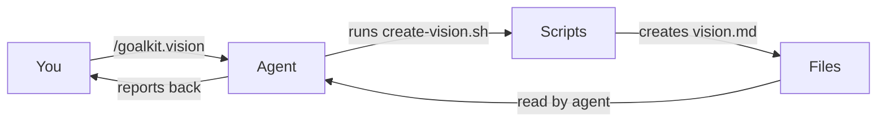
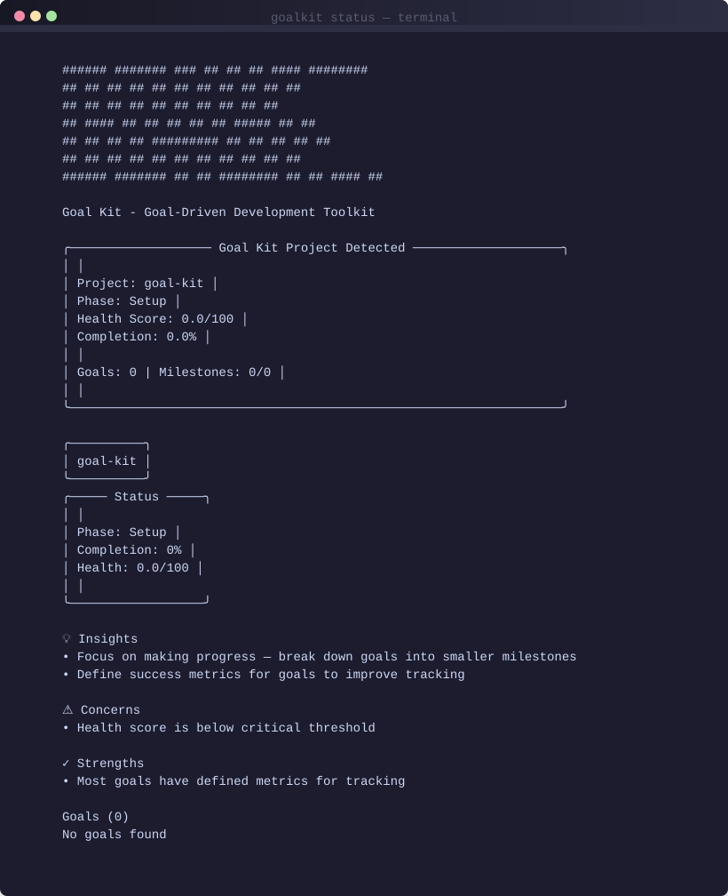

<div align="center">

# 🎯 Goalkit

**The Framework for Goal-Driven Development (GDD)**

*Anchor your AI agents in outcomes, not just code. No external APIs. Fully offline. Pure Markdown.*

[](https://github.com/Nom-nom-hub/goal-kit/releases/latest)
[](https://www.python.org/)
[](https://github.com/Nom-nom-hub/goal-kit/blob/main/LICENSE)
[](https://github.com/Nom-nom-hub/goal-kit)
[](https://github.com/Nom-nom-hub/goal-kit/stargazers)

[**Quick Start**](#-quick-start) | [**Methodology**](#-the-gdd-methodology) | [**Documentation**](https://nom-nom-hub.github.io/goal-kit/) | [**Contributing**](#-contributing)

---

</div>

## 🚀 Stop "Vibe-Coding." Start Delivering.

AI agents are incredible at writing code, but they often lack **strategic alignment**. Without a framework, agents tend to "vibe-code"—implementing features without clear success metrics or strategic trade-offs.

**Goalkit** implements **Goal-Driven Development (GDD)**, a methodology that forces AI agents to:
1.  **Define the "Why"** before the "How."
2.  **Quantify Success** with measurable metrics.
3.  **Explore Strategies** instead of picking the first path.
4.  **Validate Progress** through evidence-based milestones.

---

## 🛠️ Quick Start

### 1. Install Goalkit
```bash
uv tool install --from git+https://github.com/Nom-nom-hub/goal-kit.git goalkit
```

### 2. Initialize Your Project
```bash
goalkit init my-project
cd my-project
```

### 3. Activate Your AI Agent
Open your project in **Claude Code**, **Cursor**, or **Copilot** and run:
```text
/goalkit.vision
```

> [!IMPORTANT]
> Goalkit generates a `CLAUDE.md` (or `.cursorrules`) that contains the **GDD Protocol**. Your agent will automatically follow the strict workflow once initialized.

---

## 📖 The GDD Methodology

Goalkit isn't just a CLI; it's a structured workflow enforced through local scripts and markdown files.

### The 5-Step Alignment Loop
| Step | Command | Outcome |
| :--- | :--- | :--- |
| **1. Vision** | `/goalkit.vision` | Establishes the project's "North Star" and principles. |
| **2. Goal** | `/goalkit.goal` | Defines a measurable, tech-agnostic outcome. |
| **3. Strategy** | `/goalkit.strategies` | Compares 3+ implementation paths and trade-offs. |
| **4. Milestone** | `/goalkit.milestones` | Breaks the strategy into measurable checkpoints. |
| **5. Execute** | `/goalkit.execute` | Implements, measures, and adapts in real-time. |

---

## 🏗️ How It Works

Goalkit creates a "shadow infrastructure" in your project that agents use to stay aligned.



*   **No External APIs**: Works fully offline. Your data stays in your repo.
*   **Agent-Agnostic**: Works with Claude, Cursor, Copilot, Gemini, and more.
*   **Git-Integrated**: Automatically manages branches and commits for your goals.

---

## 📊 CLI Features

<div align="center">
  
  <br>
  <em>Real-time project health and goal completion insights.</em>
</div>

*   `goalkit status`: Get a snapshot of project health and actionable insights.
*   `goalkit check`: Verify available AI agents and system prerequisites.
*   `goalkit milestones`: Track progress across all active goal branches.
*   `goalkit report`: Generate professional progress reports for stakeholders.

---

## 👥 Contributors 💙

A huge thank you to the pioneers of Goal-Driven Development:

| Contributor | Role |
| :--- | :--- |
| [**Teck**](https://github.com/Nom-nom-hub) | Creator & Maintainer |
| [**shivam2931120**](https://github.com/shivam2931120) | Core Methodology & Testing |

Want to see your name here? Check out [CONTRIBUTING.md](./CONTRIBUTING.md) and open a PR!

---

## 📄 License

This project is licensed under the MIT License - see the [LICENSE](LICENSE) file for details.

**Goalkit**: *Focus on outcomes, not implementation details.*
