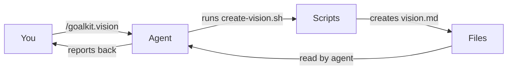
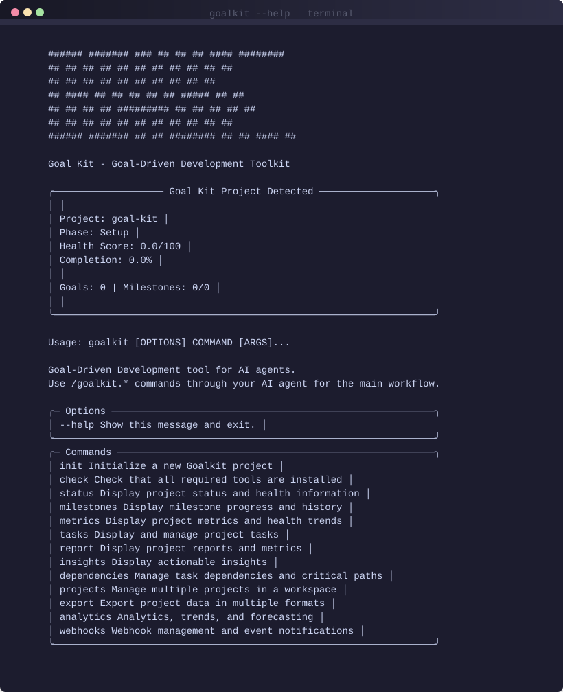
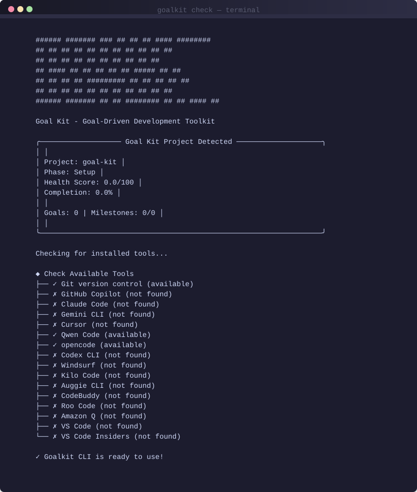

<div align="center">

# 🎯 Goalkit

*Goal-Driven Development tool for AI agents*

Work with markdown files and scripts — no external AI APIs required.

[](https://github.com/Nom-nom-hub/goal-kit/releases/latest)
[](https://www.python.org/)
[](https://github.com/Nom-nom-hub/goal-kit/blob/main/LICENSE)
[](https://github.com/Nom-nom-hub/goal-kit)

[](https://github.com/Nom-nom-hub/goal-kit)
[](https://github.com/Nom-nom-hub/goal-kit)
[](https://github.com/Nom-nom-hub/goal-kit/stargazers)
[](https://github.com/Nom-nom-hub/goal-kit/commits/main)

---

</div>

## Quick Start

### 1. Install

```bash
uv tool install --from git+https://github.com/Nom-nom-hub/goal-kit.git goalkit
```

### 2. Initialize Project

```bash
goalkit init my-project
cd my-project
```

### 3. Start with Your AI Agent

Tell your AI agent (Claude, Copilot, Cursor, etc.):

```
/goalkit.vision
```

Then follow the workflow by asking for:

```
/goalkit.goal        # Define a measurable goal
/goalkit.strategies  # Explore implementation approaches
/goalkit.milestones  # Plan progress checkpoints
/goalkit.execute     # Start building with learning
```

Your agent handles everything — creating files, running scripts, tracking progress.

---

## How It Works

Goalkit doesn't make AI agents use an external API. Instead, it gives them a structured workflow using **markdown files** and **local scripts**:

1. **You talk to your AI agent** (Claude, Copilot, Cursor, Gemini, etc.)
2. **Your agent calls `/goalkit.*` commands** which map to local bash/PowerShell scripts
3. **The scripts create/update markdown files** in `.goalkit/` — vision, goals, strategies, milestones, execution
4. **Your agent reads those markdown files** to understand project context and track progress

The scripts are not meant to be run directly by you — they're the **implementation layer** that your AI agent uses on your behalf.



All data stays in markdown files. No external AI APIs required. Works fully offline.

---

## CLI in Action

<div align="center">
  
  <br>
  <em>All 13 CLI commands for managing your Goal-Driven Development workflow</em>
</div>

<div align="center">
  
  <br>
  <em>Check which AI agents and tools are available on your system</em>
</div>

<div align="center">
  
  <br>
  <em>Get a snapshot of project health, completion, and actionable insights</em>
</div>

---

## Why Goalkit?

Instead of complex tooling, goalkit gives AI agents:

1. **Vision** — Why are we building this?
2. **Goals** — What does success look like?
3. **Strategies** — Multiple ways to get there
4. **Milestones** — Measurable progress steps
5. **Execution** — Adaptive implementation

All stored in simple markdown files that any agent can read and update.

---

## Core Workflow

| Step | Tell Your Agent | What Happens |
|------|----------------|-------------|
| 1 | `goalkit init my-project` | You run this once to set up the project |
| 2 | `/goalkit.vision` | Creates your project vision |
| 3 | `/goalkit.goal` | Defines a measurable outcome |
| 4 | `/goalkit.strategies` | Explores multiple approaches |
| 5 | `/goalkit.milestones` | Plans progress checkpoints |
| 6 | `/goalkit.execute` | Builds with learning loops |

---

## Templates (6 Core)

Goalkit uses simple markdown templates:

- `templates/vision-template.md`
- `templates/goal-template.md`
- `templates/lite-goal-template.md`
- `templates/strategies-template.md`
- `templates/milestones-template.md`
- `templates/execution-template.md`

---

## Supported AI Agents

Works with any AI agent that reads markdown:

- Claude (Code, CLI)
- Cursor
- Copilot
- Gemini
- opencode
- Any agent with file access

---

## Installation

### uv (Recommended)

```bash
uv tool install --from git+https://github.com/Nom-nom-hub/goal-kit.git goalkit
```

### pip

```bash
pip install git+https://github.com/Nom-nom-hub/goal-kit.git
```

---

## Project Structure

After `goalkit init`:

```
my-project/
├── .goalkit/
│   ├── vision.md
│   └── goals/
│       └── 001-goal-name/
│           ├── goal.md
│           ├── strategies.md
│           ├── milestones.md
│           └── execution.md
├── CLAUDE.md
└── ... (your code)
```

---

## CLI Commands

```bash
goalkit init <project>     # Initialize new project (you run this)
goalkit status              # Show project status with insights
goalkit check               # Check available AI agents and tools
goalkit milestones          # Show milestone progress
```

---

## Key Features

- ✅ Pure markdown-based workflow
- ✅ No external AI API calls
- ✅ Cross-platform (Linux, macOS, Windows)
- ✅ Works with any AI agent
- ✅ 6 simple templates
- ✅ Git integrated

---

## Documentation

- [CHANGELOG](./CHANGELOG.md) — Version history

---

**Goalkit**: Focus on outcomes, not implementation details.
