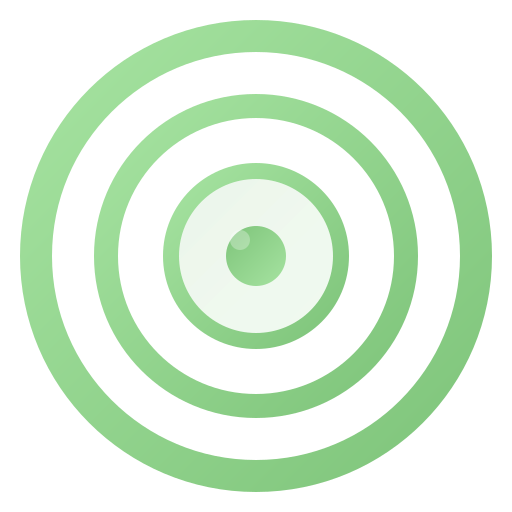

<div class="gk-hero">



<h1 class="gk-hero__title">Goal Kit</h1>

<p class="gk-hero__subtitle">
  A Goal-Driven Development toolkit for AI agents. Define outcomes, explore strategies, and execute with measurable progress — all through natural conversation with your AI coding assistant.
</p>

<div class="gk-hero__actions">
  <a href="installation/" class="md-button md-button--primary">Install Goal Kit</a>
  <a href="quickstart/" class="md-button">Quick Start →</a>
</div>

</div>

---

## Why Goal Kit?

<div class="gk-features">

<div class="gk-feature">
<div class="gk-feature__icon">🎯</div>
<h3 class="gk-feature__title">Outcome-Driven</h3>
<p class="gk-feature__desc">Focus on measurable success criteria, not feature checklists. Define what "done" looks like before you start.</p>
</div>

<div class="gk-feature">
<div class="gk-feature__icon">🧭</div>
<h3 class="gk-feature__title">Strategy Exploration</h3>
<p class="gk-feature__desc">Explore multiple implementation approaches before committing. Compare trade-offs and pick the best path.</p>
</div>

<div class="gk-feature">
<div class="gk-feature__icon">📊</div>
<h3 class="gk-feature__title">Measurable Progress</h3>
<p class="gk-feature__desc">Break goals into milestones with clear success metrics. Track velocity, momentum, and health scores over time.</p>
</div>

<div class="gk-feature">
<div class="gk-feature__icon">🔄</div>
<h3 class="gk-feature__title">Adaptive Execution</h3>
<p class="gk-feature__desc">Treat plans as hypotheses. Pivot when metrics show a better path. Learn and adapt continuously.</p>
</div>

<div class="gk-feature">
<div class="gk-feature__icon">🤖</div>
<h3 class="gk-feature__title">AI-Native</h3>
<p class="gk-feature__desc">Works with Claude Code, GitHub Copilot, Gemini CLI, Cursor, and all major AI coding assistants.</p>
</div>

<div class="gk-feature">
<div class="gk-feature__icon">⚡</div>
<h3 class="gk-feature__title">Zero Config</h3>
<p class="gk-feature__desc">One command to initialize. Your AI agent handles the rest — scripts, files, context, and progress tracking.</p>
</div>

</div>

---

## Quick Start

**1. Install Goal Kit**

```bash
uv tool install goalkit --from git+https://github.com/Nom-nom-hub/goal-kit.git
```

**2. Initialize a project**

```bash
goalkit init my-project
cd my-project
```

**3. Start with your AI agent**

```
/goalkit.vision Create a vision focused on user outcomes and measurable success
```

That's it. Your AI agent handles the rest — creating goals, exploring strategies, tracking milestones, and measuring progress.

---

## How It Works

Goal Kit implements a structured workflow that guides you from vision to execution:

| Step | Command | What Happens |
|------|---------|-------------|
| 1 | `/goalkit.vision` | AI agent creates `.goalkit/vision.md` with your project principles |
| 2 | `/goalkit.goal` | Agent creates a goal directory with measurable success criteria |
| 3 | `/goalkit.strategies` | Agent explores 3+ implementation approaches and documents trade-offs |
| 4 | `/goalkit.milestones` | Agent breaks the goal into measurable progress checkpoints |
| 5 | `/goalkit.execute` | Agent implements with continuous measurement and adaptation |

---

## Supported AI Agents

Goal Kit works with all major AI coding assistants:

Claude Code · GitHub Copilot · Gemini CLI · Cursor · Qwen Code · opencode · Codex CLI · Windsurf · Kilo Code · Auggie CLI · Roo Code · Amazon Q Developer CLI
