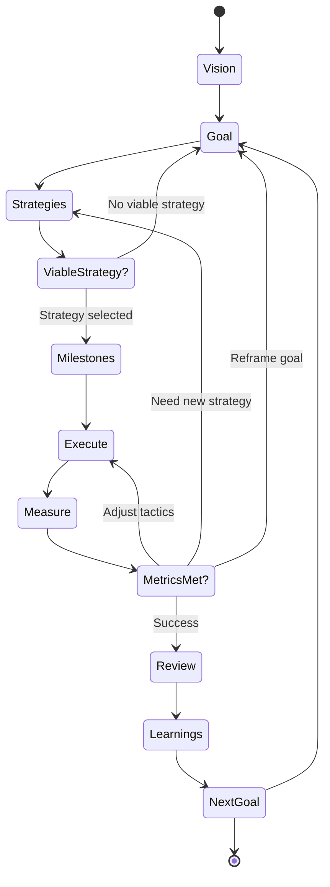

# Goal Kit Workflow Guide

## Understanding the Goal Kit Workflow

Goal Kit uses a state-based workflow that guides you from vision to execution. This guide helps you understand when to use each command and how they connect.

---

## Workflow State Machine



---

## State Descriptions

### State 1: Vision (Entry Point)
**Command**: `/goalkit.vision`

**Purpose**: Establish project principles, values, and success philosophy

**Inputs**: Project context, stakeholder needs, business objectives

**Outputs**: `.goalkit/vision.md`

**Next States**: 
- Define Goal (State 2)

**Loop Back From**: 
- Review & Learnings (update vision based on accumulated insights)

**When to use**:
- ✅ Starting a new project
- ✅ Major strategic shift in existing project
- ✅ Quarterly/annual vision refresh

**When NOT to use**:
- ❌ For individual features (use goals instead)
- ❌ For tactical changes (vision should be stable)

---

### State 2: Goal Definition
**Command**: `/goalkit.goal`

**Purpose**: Define measurable outcomes and success criteria

**Inputs**: 
- `vision.md` (for alignment)
- User needs, business requirements

**Outputs**: `goals/###-name/goal.md`

**Next States**: 
- Explore Strategies (State 3)

**Loop Back From**: 
- Strategy Exploration (if no viable strategy found)
- Execution (if goal needs reframing based on learning)

**When to use**:
- ✅ New user outcome to achieve
- ✅ Different success metrics than existing goals
- ✅ Distinct beneficiary or value proposition

**When NOT to use**:
- ❌ Refinement of existing goal → update existing `goal.md`
- ❌ Implementation detail → that's a strategy or milestone
- ❌ Task breakdown → use `/goalkit.tasks` instead

---

### State 3: Strategy Exploration
**Command**: `/goalkit.strategies`

**Purpose**: Explore multiple approaches to achieve the goal

**Inputs**: 
- `goal.md` (success criteria to meet)
- `vision.md` (constraints and principles)
- Technical context, resource constraints

**Outputs**: `goals/###-name/strategies.md`

**Next States**: 
- Plan Milestones (State 4) - if viable strategy selected
- Loop to Goal (State 2) - if no viable strategy exists

**Loop Back From**: 
- Execution (if current strategy not working)
- Milestones (if milestones reveal strategy flaws)

**When to use**:
- ✅ First time approaching a goal
- ✅ Current strategy failing to meet metrics
- ✅ New constraints emerged (budget, timeline, tech)
- ✅ Discovered better approach during execution

**When NOT to use**:
- ❌ Strategy is working → continue execution
- ❌ Minor tactical adjustments → adjust in execution, not new strategy

---

### State 4: Milestone Planning
**Command**: `/goalkit.milestones`

**Purpose**: Break strategy into measurable progress checkpoints

**Inputs**: 
- `strategies.md` (selected strategy)
- `goal.md` (success criteria to validate)

**Outputs**: `goals/###-name/milestones.md`

**Next States**: 
- Execute (State 5)

**Loop Back From**: 
- Execution (if milestones need adjustment based on learning)

**When to use**:
- ✅ Strategy selected and ready to plan
- ✅ Strategy changed significantly
- ✅ New information about scope or complexity
- ✅ Milestones proven unachievable (need replanning)

**When NOT to use**:
- ❌ Milestones still valid → continue execution
- ❌ Minor milestone adjustments → update `milestones.md` directly

---

### State 5: Execute
**Command**: `/goalkit.execute`

**Purpose**: Implement the strategy, milestone by milestone

**Inputs**: 
- `milestones.md` (what to build)
- `strategies.md` (how to build it)
- `goal.md` (success criteria)

**Outputs**: 
- `goals/###-name/execution.md`
- Working code/features
- Measurement data

**Next States**: 
- Measure (State 6)

**Loop Back From**: 
- Measure (if tactics need adjustment)

**When to use**:
- ✅ Milestones defined and ready to build
- ✅ Daily/weekly execution work
- ✅ Implementing features, writing code

**When NOT to use**:
- ❌ Strategy unclear → go back to strategies
- ❌ Milestones undefined → go back to milestones

---

### State 6: Measure
**Command**: `/goalkit.report` or manual metric collection

**Purpose**: Collect and analyze success criteria metrics

**Inputs**: 
- `goal.md` (success criteria definitions)
- Analytics data, user feedback, system metrics

**Outputs**: 
- Metric values and trends
- Progress reports

**Next States**: 
- Continue Execute (if metrics on track, tactics working)
- Adjust Execute (if metrics need tactical changes)
- New Strategies (if strategy fundamentally not working)
- Reframe Goal (if goal itself needs changing)
- Review (if metrics met, goal achieved)

**When to use**:
- ✅ After each milestone completion
- ✅ Weekly/daily for real-time metrics
- ✅ When deciding whether to pivot

**When NOT to use**:
- ❌ Before instrumentation is ready
- ❌ Too early to have meaningful data

---

### State 7: Review & Learnings
**Commands**: `/goalkit.review` and `/goalkit.learnings`

**Purpose**: Reflect on goal achievement and capture insights

**Inputs**: 
- All goal artifacts (goal, strategies, milestones, execution)
- Metric data
- Team feedback

**Outputs**: 
- `goals/###-name/review.md`
- `goals/###-name/learnings.md`

**Next States**: 
- Next Goal (State 2)
- Update Vision (State 1) - if learnings suggest vision changes
- Project Complete

**When to use**:
- ✅ Goal fully achieved (all success criteria met)
- ✅ Goal abandoned (document why)
- ✅ Major milestone completed (interim review)

**When NOT to use**:
- ❌ Mid-execution without significant learnings
- ❌ Before goal completion (unless abandoning)

---

## Decision Trees

### Should I create a new goal?

```
Is this a new user outcome to achieve?
├─ YES: Is it measurably different from existing goals?
│  ├─ YES: Create new goal (/goalkit.goal)
│  └─ NO: Update existing goal.md
└─ NO: Is this an implementation approach?
   ├─ YES: This is a strategy, not a goal
   └─ NO: Is this a task breakdown?
      ├─ YES: Use /goalkit.tasks
      └─ NO: Clarify what you're trying to achieve
```

### Should I explore new strategies?

```
Is current strategy meeting metrics?
├─ YES: Continue execution, no new strategies needed
└─ NO: Why are metrics not met?
   ├─ Tactical issues (bugs, minor adjustments)
   │  └─ Adjust execution, keep strategy
   ├─ Strategy fundamentally flawed
   │  └─ Explore new strategies (/goalkit.strategies)
   └─ Goal itself unrealistic
      └─ Reframe goal (/goalkit.goal)
```

### Should I create new milestones?

```
Has strategy changed significantly?
├─ YES: Create new milestones (/goalkit.milestones)
└─ NO: Are current milestones achievable?
   ├─ YES: Continue execution
   └─ NO: Why unachievable?
      ├─ Scope increased
      │  └─ Replan milestones
      ├─ Strategy wrong
      │  └─ Go back to strategies
      └─ Goal unrealistic
         └─ Go back to goal
```

### When should I pivot?

```
Check metric status:
├─ All metrics in GREEN zone
│  └─ Continue current approach
├─ Some metrics in YELLOW zone
│  └─ Investigate and adjust tactics
└─ Metrics in RED zone for [threshold duration]
   └─ Pivot decision:
      ├─ Tactical pivot: Adjust execution approach
      ├─ Strategic pivot: Choose different strategy
      └─ Goal pivot: Reframe the goal itself
```

---

## Common Workflow Patterns

### Pattern 1: New Feature Development

```
Vision (if new project)
  ↓
Goal (user outcome)
  ↓
Strategies (3+ technical approaches)
  ↓
Milestones (3-5 checkpoints)
  ↓
Execute (build incrementally)
  ↓
Measure (validate metrics)
  ↓
Review & Learnings
```

**Example**: "Enable users to collaborate in real-time"
- Goal: 80% of teams use real-time collaboration weekly
- Strategies: WebSocket, Polling, Hybrid
- Milestones: M1-Infrastructure, M2-Client, M3-Scale
- Execute: Build and deploy
- Measure: Track adoption and latency
- Review: Document what worked

---

### Pattern 2: Performance Optimization

```
Goal (performance target)
  ↓
Strategies (profiling approaches)
  ↓
Milestones (incremental improvements)
  ↓
Execute → Measure (tight loop)
  ↓
Review & Learnings
```

**Example**: "Reduce page load time by 50%"
- Goal: P95 load time < 2s (from 4s)
- Strategies: CDN, Code splitting, Caching
- Milestones: M1-Measure baseline, M2-Quick wins, M3-Deep optimization
- Execute & Measure: Continuous profiling and optimization
- Review: Document optimization patterns

---

### Pattern 3: Exploratory Innovation

```
Vision (exploration focus)
  ↓
Goal (learning objective)
  ↓
Strategies (multiple experiments)
  ↓
Milestones (hypothesis tests)
  ↓
Execute → Measure → Pivot (rapid iteration)
  ↓
Review & Learnings (capture insights)
```

**Example**: "Discover if AI-powered search improves user satisfaction"
- Goal: Learn if AI search increases NPS by 10+ points
- Strategies: GPT-based, Semantic search, Hybrid
- Milestones: M1-Prototype, M2-A/B test, M3-Analyze
- Execute & Measure: Rapid experimentation
- Review: Document learnings regardless of success

---

## Workflow Anti-Patterns

### ❌ Anti-Pattern 1: Skipping Strategy Exploration

**What it looks like**:
```
Goal → Milestones → Execute
(Skipped strategies)
```

**Why it's bad**: 
- Commits to first idea without exploring alternatives
- Misses better approaches
- No fallback if chosen approach fails

**Fix**: Always explore 2-3 strategies, even if one seems obvious

---

### ❌ Anti-Pattern 2: Goals That Are Actually Specs

**What it looks like**:
```
Goal: "Build a REST API with 5 endpoints"
(This is a specification, not an outcome)
```

**Why it's bad**: 
- Focuses on implementation, not user value
- Can't measure success meaningfully
- Misses the "why"

**Fix**: Reframe as outcome
```
Goal: "Enable mobile app to sync data reliably (95% success rate)"
```

---

### ❌ Anti-Pattern 3: Unmeasurable Success Criteria

**What it looks like**:
```
Success Criteria: "Users are happy with the feature"
```

**Why it's bad**: 
- Can't objectively determine success
- No clear decision threshold
- Leads to endless iteration

**Fix**: Make it measurable
```
Success Criteria: "NPS score ≥ 8/10, 80% daily active usage"
```

---

### ❌ Anti-Pattern 4: Never Pivoting

**What it looks like**:
```
Execute → Metrics failing → Continue executing same approach
(Ignoring red zone metrics)
```

**Why it's bad**: 
- Wastes time on failing approach
- Misses opportunity to learn and adapt
- Demoralizes team

**Fix**: Set pivot triggers
```
If metric < threshold for 2 weeks → Explore new strategy
```

---

## Workflow Checklist

Use this checklist to ensure you're following the workflow correctly:

### Vision Phase
- [ ] Vision document created
- [ ] Success philosophy defined
- [ ] Principles documented
- [ ] Team aligned on vision

### Goal Phase
- [ ] User outcome clearly defined
- [ ] Success criteria are measurable
- [ ] Baseline metrics captured
- [ ] Goal aligns with vision

### Strategy Phase
- [ ] Explored 2-3+ different approaches
- [ ] Compared strategies objectively
- [ ] Selected strategy with clear rationale
- [ ] Documented why alternatives rejected

### Milestone Phase
- [ ] Milestones deliver standalone value
- [ ] Each milestone is measurable
- [ ] Milestones validate riskiest assumptions first
- [ ] Timeline is realistic

### Execution Phase
- [ ] Building according to selected strategy
- [ ] Measuring metrics continuously
- [ ] Documenting learnings as you go
- [ ] Willing to pivot if metrics fail

### Review Phase
- [ ] All success criteria evaluated
- [ ] Learnings documented
- [ ] Team retrospective completed
- [ ] Insights applied to future goals

---

## Getting Help

### I'm stuck at [State]. What should I do?

**Stuck at Vision**: 
- Review project objectives with stakeholders
- Look at similar projects for inspiration
- Start with draft, refine over time

**Stuck at Goal**: 
- Focus on user outcome, not features
- Make success criteria specific and measurable
- Start with one goal, add more later

**Stuck at Strategies**: 
- Research how others solved similar problems
- Brainstorm with team
- Consider technical, UX, and implementation dimensions

**Stuck at Milestones**: 
- Break strategy into 3-5 major phases
- Ensure each milestone validates something
- Front-load riskiest assumptions

**Stuck at Execution**: 
- Review milestones and strategies
- Check if strategy is still viable
- Consider if you need to pivot

---

## Quick Reference

| Situation | Command | Output |
|-----------|---------|--------|
| Starting new project | `/goalkit.vision` | vision.md |
| New feature/outcome | `/goalkit.goal` | goal.md |
| Choosing approach | `/goalkit.strategies` | strategies.md |
| Planning execution | `/goalkit.milestones` | milestones.md |
| Building feature | `/goalkit.execute` | execution.md |
| Tracking progress | `/goalkit.report` | report.md |
| Retrospective | `/goalkit.review` | review.md |
| Capturing learnings | `/goalkit.learnings` | learnings.md |

---

*This workflow guide is part of the Goal Kit methodology. For more details, see the [Goal-Driven Development guide](../goal-driven.md).*
